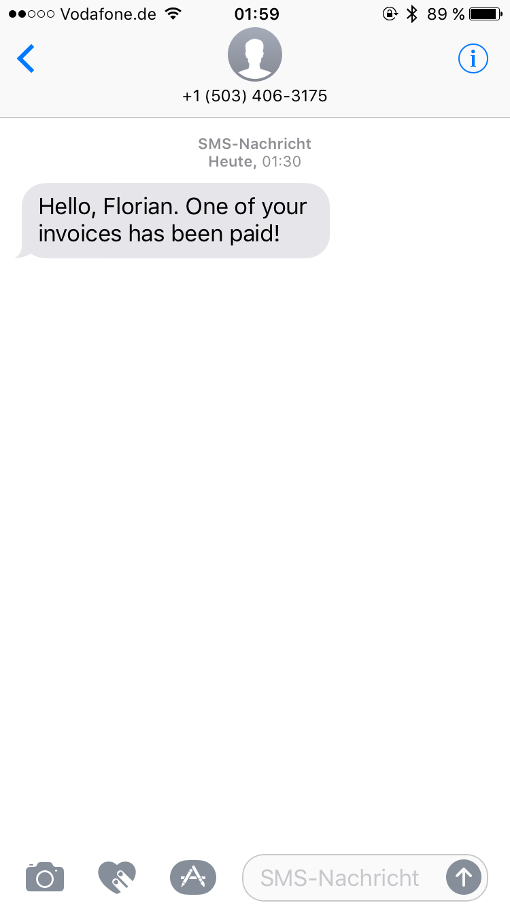

# Twilio Laravel Notifications Provider

If you don´t want to use Nexmo for the sms notifications in your Laravel 5.3 application, you can use this provider to fire your notifications using Twilio. 

## Installation

To pull the Twilio-Provider into your application 
```
composer require laravel-notification-channels/twilio
 ```

Now register the Provider within your application in your `config/app.php`:

```php
 'providers' => [
     ...
     NotificationChannels\Twilio\TwilioProvider::class,
 ];
 ```

Now you need to set up your `config/services.php` with the values according to your Twilio account:

```php
'twilio' => [
    'sid' => env('TWILIO_SID'),
    'token' => env('TWILIO_TOKEN'),
    'number' => env('TWILIO_NUMBER')
],
```

Don´t forget to set these variables in your `.env` file.

Add the following methods to your user-model
```php
public function routeNotificationForTwilio()
{
    return $this->phone_number;
}
public function sendingNumberForTwilio()
{
    return +123456789;
}
```

The 'routeNotificationForTwilio' is meant to return the actual phone number of the Notifiable Model.
The 'sendingNumberForTwilio' is meant to be able to choose one of your twilio purchased numbers, if you have more than one. It still works with the basic functionality if you set the .env TWILIO_NUMBER variable.

## Usage

Create a new notification-class by running `php artisan make:notification YOUR_NOTIFICATION_NAME`.
Now edit this class like this:

```php
...

use NotificationChannels\Twilio\Channel as TwilioChannel;
use NotificationChannels\Twilio\Message;

...

/*
* Get the notification's delivery channels.
*
* @param  mixed  $notifiable
* @return array
*/
public function via($notifiable)
{
    return [TwilioChannel::class];
}

...

/*
* Get the sms representation of the notification.
*
* @param  mixed  $notifiable
* @return \NotificationChannels\Twilio\Message
*/
public function toTwilio($notifiable)
{
    return Message::create()
        ->content("Hello, Florian. One of your invoices has been paid!");
}
```

This is what your notification will look like:


## Credits

- [Florian Wartner](https://github.com/fwartner)
- [All Contributors](../../contributors)

## License

The MIT License (MIT). Please see [License File](LICENSE.md) for more information.
